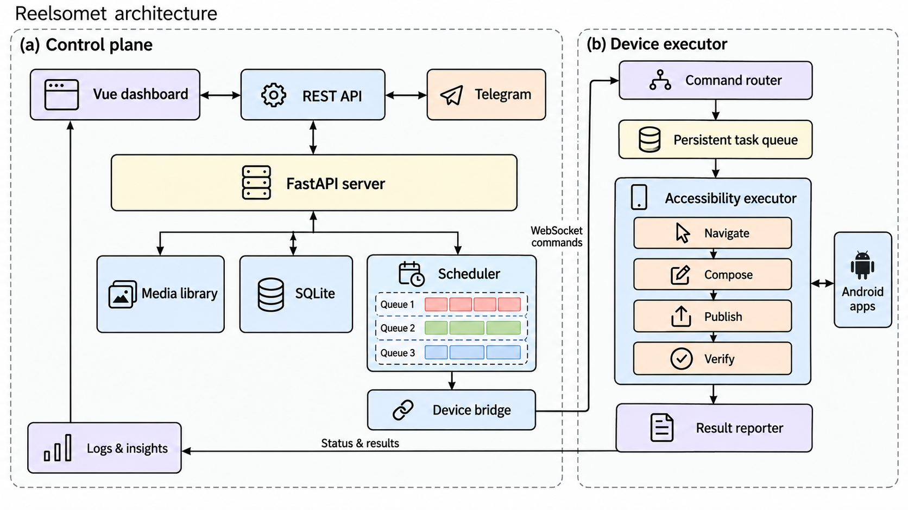

<div align="center">

# Reelsomet

**A self-hosted control plane for publishing through Android devices.**

Plan content. Queue work. Execute on a device. Observe the result.

[](https://github.com/parlorsky/reelsomet-open-source/actions/workflows/ci.yml)
[](LICENSE)
[](docs/status.md)

[Quick start](#quick-start) · [Architecture](docs/architecture.md) · [Reuse the components](#reuse-the-components) · [Development](docs/development.md) · [Русский](README.ru.md)



</div>

Reelsomet connects a Vue dashboard and Python scheduler to a Kotlin Android agent. The server owns content, schedules and records; the phone performs app-specific actions through Android Accessibility and reports its progress back. You can self-host the complete system, study the scheduling and device protocol, or reuse individual components under the MIT license.

This is an **experimental source release** of an existing application. Instagram publishing is the main workflow; Pinterest and Reddit adapters are included for development. Device behavior depends on the installed apps, Android version and UI language. Start with a device and account you control, and review the [validation status and limitations](docs/status.md).

## What is included

- **Python control plane:** FastAPI endpoints, JWT authentication, SQLite persistence, account schedules and media queues.
- **Vue dashboard:** devices, accounts, content library, posting queue, schedules, logs and insights.
- **Android executor:** a Room-backed task queue, WebSocket commands, Accessibility workflows and status reporting.
- **Media utilities:** FFmpeg rendering, captions, video preparation, photo sets and story assets.
- **Extension points:** optional Telegram controls, configurable LLM endpoints, and platform-specific adapters.

There is no license server, activation key, hardware binding or device-count paywall in this edition. Telegram, an LLM service and the separate Ghost media engine are optional; they are not required to start the dashboard and queue existing videos.

## Quick start

### Run with Docker Compose

Install Docker with the Compose plugin, then:

```sh
git clone https://github.com/parlorsky/reelsomet-open-source.git
cd reelsomet-open-source
docker compose up --build -d
docker compose logs reelsomet
```

Open **http://localhost:8000**. Copy the first-run setup token from the server log, choose an administrator password, and save the device token shown after setup. The setup token becomes invalid after the administrator is created.

The default Compose configuration listens on loopback and stores configuration, SQLite and media in the `reelsomet-data` Docker volume. It can run without a phone for inspecting the dashboard. See [deployment](docs/deployment.md) before connecting a physical device or exposing a remote server.

### Run from source

Prerequisites: Python 3.11+, Node.js 22.12+ and FFmpeg/ffprobe on `PATH`.

```sh
python3 -m venv .venv
. .venv/bin/activate
python -m pip install -r requirements.lock
npm ci --prefix web
npm run build --prefix web
python -m server.main
```

A fresh install creates `var/config.yaml` and `var/data/`. Run commands from the repository root. Existing configuration is preserved on restart. See [configuration](config.example.yaml) for the available starting settings.

### Connect an Android device

1. Open `android/` in Android Studio, or use JDK 17 and Android SDK 34 to run `cd android && ./gradlew :app:assembleDebug`.
2. Install `android/app/build/outputs/apk/debug/app-debug.apk` on a device you control.
3. In the app, set your server URL, device ID **1**, and the device token generated during setup.
4. Enable the requested Accessibility service and media access. Keep the intended publishing app installed and signed in.
5. Verify the device appears online in the dashboard, then try one disposable test post before scheduling a batch.

A phone cannot reach your computer through the phone's `localhost`. Use a reachable server address with HTTPS/WSS, or an explicitly configured isolated development network. [Android setup and limitations →](docs/android.md)

## How it works

1. An operator adds media and associates it with an account.
2. The scheduler selects eligible work using account settings, availability, cooldowns and queue state.
3. The device bridge sends an identified command through WebSocket; media is transferred through scoped download endpoints.
4. The Android router dispatches work to persistent tasks and app-specific Accessibility flows.
5. Results, logs and device state return to the server and update the dashboard.

The flow is conceptual: protocol acknowledgements confirm transport, while publishing outcomes come from device state and app-specific checks. A timeout alone does not prove that a post was never published. The source contains reconciliation and duplicate-handling logic, but this release makes no exactly-once delivery guarantee.

[Read the architecture and source map](docs/architecture.md) · [Editable SVG](docs/assets/architecture.svg) · [High-resolution PNG](docs/assets/architecture.png)

## Reuse the components

| You want to… | Start here |
| --- | --- |
| Build a dashboard client | [`server/api/`](server/api/), the running server's `/docs`, [`examples/api_client.py`](examples/api_client.py) |
| Reuse the device transport | [`server/ws/protocol.py`](server/ws/protocol.py), [`server/ws/bridge.py`](server/ws/bridge.py) |
| Understand scheduling and recovery | [`server/scheduler.py`](server/scheduler.py), [`tests/test_scheduler.py`](tests/test_scheduler.py) |
| Prepare media with FFmpeg | [`server/video_gen.py`](server/video_gen.py), [`tests/test_video_gen.py`](tests/test_video_gen.py) |
| Build another Android workflow | [`android/app/src/main/java/com/reelsomet/poster/`](android/app/src/main/java/com/reelsomet/poster/) |
| Adapt the architecture figure | [`scripts/draw_architecture.py`](scripts/draw_architecture.py), [`docs/assets/`](docs/assets/) |

These modules originate in one application and are not separately versioned libraries. Copy the pieces you need, preserve the MIT notice, and run their tests when changing the interfaces.

## Repository map

```text
server/             FastAPI, database, scheduling, media and WebSocket transport
web/                Vue 3 + TypeScript dashboard
android/            Kotlin Android agent and Gradle wrapper
data/fsm/           Versioned workflow definitions; no user content
tests/              Backend and protocol regression tests
examples/           Small reusable client examples
docs/               Architecture, deployment, development and release status
scripts/            Figure regeneration
```

## Development & contributing

See [development](docs/development.md) for tests, UI development and Android builds. Contributions that improve reproducibility, device compatibility and clear failure reporting are welcome. Read [CONTRIBUTING.md](CONTRIBUTING.md) and [SECURITY.md](SECURITY.md) before opening an issue. Please use synthetic examples instead of real account credentials or publishing logs.

## License & provenance

[MIT](LICENSE). Commercial use, modification and redistribution are permitted with the license notice. Third-party components retain their own licenses; see [THIRD_PARTY_NOTICES.md](THIRD_PARTY_NOTICES.md).

This repository is a clean source distribution assembled from the author's Android and server working trees, with selected newer source files from a deployment snapshot. It excludes operational databases, private media, signing keys, compiled-only modules, the earlier desktop controller and deployment credentials. See [source provenance](docs/provenance.md).

The paper-style illustrations describe software architecture. They do not represent an arXiv publication, benchmark result, or affiliation with the platforms shown.
