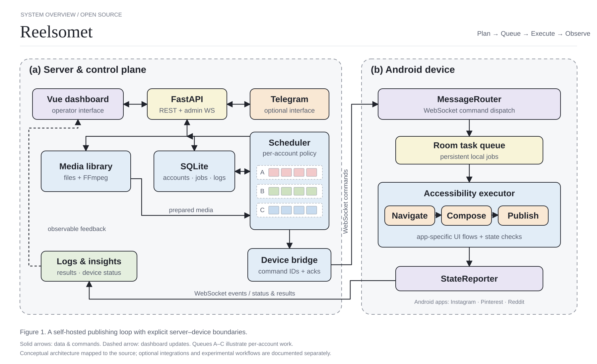

# Architecture



Reelsomet separates operator intent, server-side scheduling and device-side execution. The server is one Python process with SQLite and local media storage. The Android agent has its own persistent state; disconnecting a device does not make the server a source of truth for every action already performed on the phone.

## Control plane

The Vue app calls FastAPI REST endpoints and receives live updates through the admin WebSocket. `server/app.py` constructs the database, device manager, bridge, scheduler and optional Telegram integration. The same server serves a built dashboard when `web/dist/index.html` exists.

`server/models.py` holds accounts, device assignments, videos, posting records and platform-specific state. `server/database.py` creates tables and applies the existing application's additive migrations. The release uses SQLite with WAL; it has not been validated with a different database.

`server/scheduler.py` runs recurring jobs through APScheduler. Account settings and persisted queue state determine eligibility. Media preparation uses local files and `server/video_gen.py`; generated outputs and upload records belong in the configured data directory. The A–C lanes in the figure illustrate per-account work, not three fixed worker threads.

## Device boundary

`server/ws/protocol.py` defines message types and message envelopes. `server/ws/manager.py` tracks connections; `server/ws/bridge.py` maps commands to request IDs, response futures and timeouts. Separate admin and screen channels support operator visibility. Inspect these files before extending the protocol: server Python types and Android routing must evolve together.

On Android, `ws/WebSocketClientService.kt` owns the connection, `ws/MessageRouter.kt` dispatches messages, and `ws/StateReporter.kt` reports state. Room stores local jobs and records. Accessibility services and platform-specific state machines drive the installed applications. Not every control command enters the persistent queue; the figure shows the main publishing path.

## Feedback and failure handling

Device events and server polling reconcile posting outcomes into queue and log records. Command acknowledgement, file download and successful publication are distinct events. Retries must respect previously observed outcomes; transport timeouts are ambiguous. This is especially important when adapting the executor to a different app.

The current scheduler reports action-blocked events; it does not automatically quarantine the account. Operators can pause or block an account explicitly. Insights collection is driven by due jobs for posted videos, not simply by every enabled account.

## Optional pieces

- Telegram controls and notifications need a user-supplied bot token and permitted chat IDs.
- LLM-assisted workflows need a separately configured service. Existing media can be queued without one.
- `server/ghost.py` is an adapter to the separately distributed `ghostcli` engine. That engine and its donor assets are not included. Ghost is disabled in a fresh installation. Some experimental photo-preparation routes require it and report that requirement when called.
- Pinterest and Reddit retain independent manifest, queue and executor code. Their presence is not a claim of device compatibility on all current app versions.

## Recreating the figure

```sh
python scripts/draw_architecture.py
```

This regenerates `docs/assets/architecture.svg` using only the Python standard library. Edit labels, colors and routing in the script. For a bitmap export, install CairoSVG and its Cairo runtime, then run `cairosvg docs/assets/architecture.svg -o docs/assets/architecture.png -s 1.5`.

The README cover was generated with ImageGen and reviewed against the implementation. The editable SVG is maintained directly from source. Both are included under this repository's MIT license; see [asset provenance](assets/README.md).
